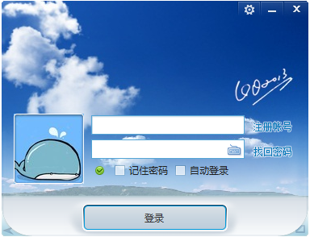
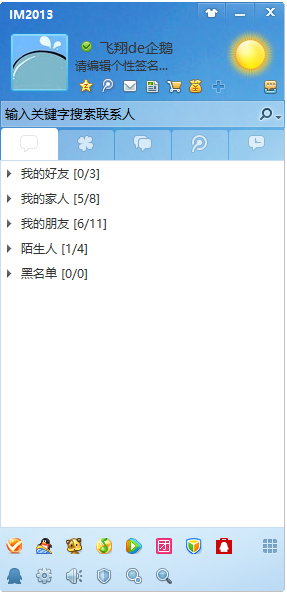
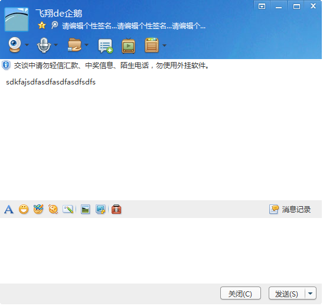
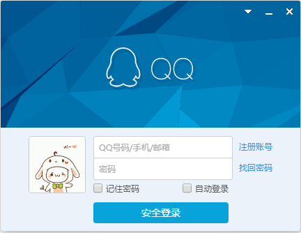
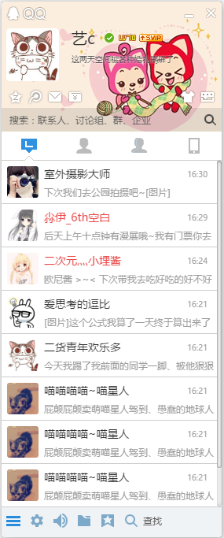
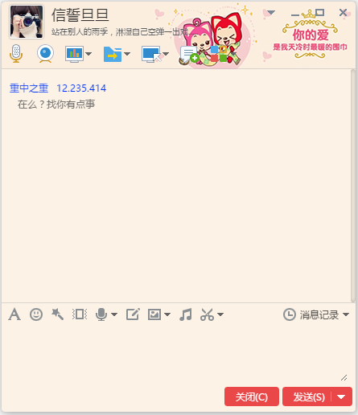

# Eutoxeres IM (Deprecated)

## What is Eutoxeres IM?

Eutoxeres IM ("Eutoxeres Instant Messenger") is an instant messenger for the desktop.

## Snapshot

* Swing version

* Web version(Electron)

## Contributing

Pull requests are being accepted! If you would like to contribute, simply fork
the project and make your changes.

##Support:

Support now is given by me.

## License

The MIT License